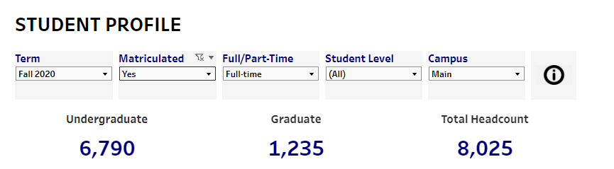
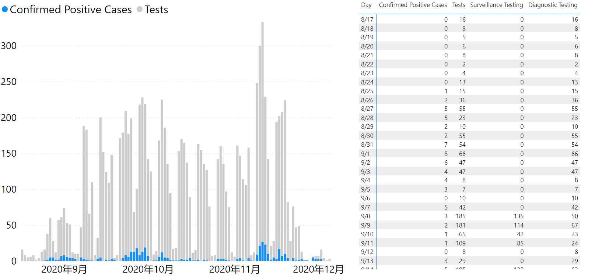
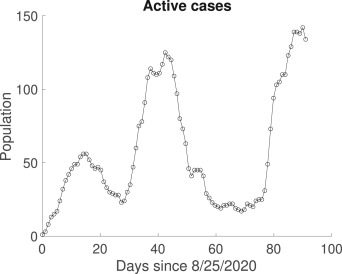
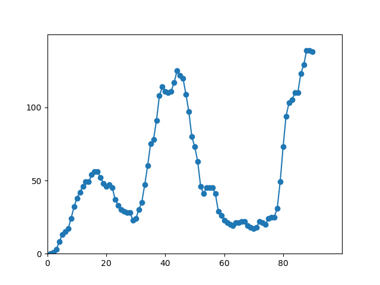

### Crowd Motion and Infectious Disease Modeling for Campus COVID-19 Control

------

#### 论文

##### 2.0！！COVID-19 在大学校园中传播的数学模型

https://www.sciencedirect.com/science/article/pii/S2468042721000567

##### A_Multi-level_Biosensor-based_Epidemic_Simulation_Model_for_COVID-19

##### 香港流调信息 --使用人口流动和混合的数字代理实时跟踪和预测 COVID-19 感染

https://www.nature.com/articles/s41467-021-21776-2

##### 1.0！！模拟 COVID-19 在小型大学中的传播

https://journals.plos.org/plosone/article?id=10.1371/journal.pone.0255654

**面向校园疫情防控的人群运动行为及疫情传播建模研究**

在本文中，我们提出了一种基于代理模型，模拟一个相对真实的校园环境，用于分析COVID-19 在大学校园内的传播和校园防疫政策的有效性。我们基于目前对 COVID-19 的了解，修改标准的SEIR模型，将感染类分为无症状感染者、轻症感染者和重症感染者，同时提出基于空间风险和空间感染人数的感染概率公式，模拟校园中病毒的传播和感染。我们的目标是深入了解哪些措施最有效，并且尽可能准确地预测每日的感染人数。本文另一个创新在于，将学校管理政策的强度和代理对政策遵从度同时研究。我们通过最终感染人数的相对变化以及对基本再生数R0的影响来分析防疫政策有效性。我们发现，核酸轮检和佩戴口罩是非常有效的单一防控措施。学校制定强有力的管理政策结合学生对管理政策的积极遵守才能有效的控制校园疫情的传播。最后，我们使用来自维拉诺瓦大学 2020 年秋季 COVID-19在线数据验证模型，发现当超级传播事件被纳入模型时模型和数据拟合效果很好。

#### 4.1 佩戴口罩

#### 4.2 核酸轮检和自我检测

#### 4.3 关闭部分建筑

#### 4.4 线下、线上混合上课

#### 4.5 减少学生聚集

4.6 模型参数总结

我们在校园网络上开发了一个基于代理的模型，旨在发现COVID-19在校园中传播的特点以及分析有效的防疫措施。我们发现，学校制定有效管理政策和学生对政策积极遵守才能有效的控制疫情的传播。强有力的防控政策包括每周一次的核酸检测和关闭部分建筑等。学生的积极遵从意味着积极戴口罩、减少社交活动以及参加核酸检测。我们还发现，核酸轮检和佩戴口罩是非常有效的单一防控措施。根据学生的行为，关闭建筑物可能导致其他地区的感染高峰，而更快地返回测试结果可显着减少总感染。

------

#### 数据集

维拉诺瓦大学

数据集：https://app.powerbi.com/view?r=eyJrIjoiYmUzZjJkMzQtNmQ3Mi00MTBhLWFkNWYtYjQwN2NhZTc0ZDZhIiwidCI6Ijc2NWE4ZGU1LWNmOTQtNDRmMC05Y2FmLWFlNWJmOGNmYTM2NiIsImMiOjF9&pageName=ReportSection.%20Accessed:%202021-03-03		以日为时间统计的

学生比例：https://www1.villanova.edu/villanova/provost/decision-support/student-profile.html

一共有8025学生

总人数：https://www1.villanova.edu/university/business/about-vsb/diversity-equity-inclusion/demographics.html

校历：https://www1.villanova.edu/villanova/artsci/graduate/academiccalendar.html

Fall 2020 8 月 17 日至 12 月 6 日

我们通过查看病例总数的相对变化以及测量对估计的基本再生数的影响来分析有效性

在模型中加入冲击事件拟合数据

https://covid19.illinois.edu/on-campus-covid-19-testing-data-dashboard/

### 代码

1.修改基础模型参数，模型结果100轮，100次，以%95的置信区间画出

2.为了拟合数据，修改模型参数，

as：

A 、加入接触者追踪

B、加入超级事件

在day = 14 35 86

### 分析

拟合数据

在base7000的基础上看感染人数

我们通过查看病例总数的相对变化以及测量对估计的基本再生数的影响来分析有效性。

28号之前完成防疫政策的结果仿真

25	experiment6

26	experiment2,experiment3,experiment4

27	experiment1,experiment5

28	开始整体图

29	https://www.pnas.org/doi/10.1073/pnas.2112532119#bibliography

30	https://ieeexplore.ieee.org/abstract/document/9736549/figures#figures

我们假设校园人口可以分为具有不同集体行为的两组：学生和教师。我们假设总人口是恒定的（包括死亡人数），并且在学期期间没有学生转学或教师招聘

As3。我们将整个学生和教师群体分为以下几类：易感（S i）、暴露（非传染性，E i）、无症状/症状前（传染性，A i）、有症状（传染性，I i）、隔离（Q i )、隔离 ( L i )、康复 ( R i ) 和已故 ( D i）。隔离类别包括通过假阳性测试确定的任何人或通过接触者追踪确定但实际上没有患病的人。在完成假定的 14 天隔离后，该组将返回易感类。

恢复者至少获得了持续学期的临时免疫力，因此康复者不会再次变得易感。关于临时免疫的持续时间（如果有的话）的研究仍在进行中（Wu et al., 2021）。

7. 我们假设社交距离、口罩使用、洗手等的影响是通过易感人群和感染人群之间的接触率变化来模拟的。我们预计这些措施将减少每天的接触人数和传播的可能性。我们随机改变有效性，因为目前尚不清楚这些措施中的每一项对接触和传播的影响程度。

8. 我们假设有症状和无症状的学生和教师的平均康复时间相同，但考虑到两组之间的年龄差异，我们对每个组使用不同的死亡率。

As9。在不使用接触者追踪或监测测试的情况下，我们消除了无症状人员被隔离的可能性。在接触者追踪和/或监测测试的情况下，我们假设暴露和无症状/症状前的个体都可能因此被隔离。然后，我们分配通过追踪 ( T )捕获的那些病例的一定比例以及追踪过程隔离个体所需的平均天数 ( ψ )。

作为10。在具有网关测试和/或监视测试的模型中，我们假设该测试不会捕获所有情况。我们规定了在 ( Bisoffi et al., 2020 )中找到的范围内使用的测试的一组敏感性和特异性。

作为11。假设部分有症状的人在出现症状后的一定天数内被隔离。我们假设可能有一些人的症状非常轻微，以至于他们没有自我报告和/或隐藏症状或不遵守隔离规则的人。因此，有症状的人有可能与易感人群互动。

作为12。该模型不考虑长期疾病或住院。这些是重要的考虑因素和可能的，但不影响对个人和机构缓解措施有效性的分析，这些措施旨在减少感染数量而不是疾病的严重程度，因此这里不予考虑。

As13。该模型没有解决潜在医疗条件的影响或不同种族/族裔群体之间的差异。我们认识到，一些群体更有可能受到 COVID-19 爆发的影响，即使模型没有明确表明这一点。
